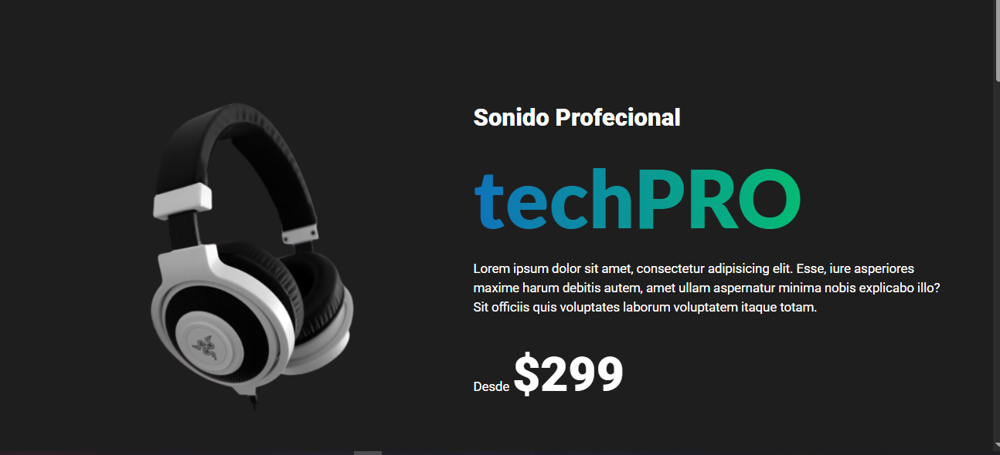

# TechPRO (Audífonos)

## Descripción
Este proyecto es una página web dedicada a la promoción y venta de audífonos de la marca TechPRO. Incluye información sobre los productos, características, y un formulario de suscripción para recibir actualizaciones.

[TechPRO](https://techpro-2025.netlify.app)




## Estructura del Proyecto
- `index.html`: Página principal del sitio.
- `css/style.css`: Estilos para el sitio.
- `js/imagenes.js`: Script para manejar imágenes y funcionalidades interactivas.
- `img/`: Carpeta que contiene las imágenes utilizadas en el sitio.

## Instalación
1. Clona el repositorio:
   ```
   git clone <URL del repositorio>
   ```
2. Abre el archivo `index.html` en tu navegador para ver el sitio.

## Contribuciones
Las contribuciones son bienvenidas. Por favor, abre un issue o envía un pull request para discutir cambios.

## Licencia
Este proyecto está bajo la Licencia MIT.
